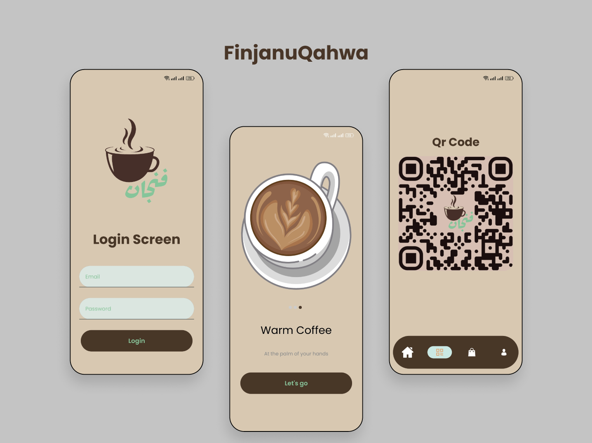

<h2 align="center">Prof. Traning in Mobile App Programming</h2>
<h3 align="center">Ahmed Walid</h3>

<p align="center">
    Coffee Shop app made with Jetpack Compose
    <br />
    <a href="https://github.com/ahmeddwalid/Finjan/blob/main/README.md"><strong>Explore the docs »</strong></a>
    <br />
    <br />
    <a href="https://github.com/ahmeddwalid/Finjan/issues">Report Bug</a>
    ·
    <a href="https://github.com/ahmeddwalid/Finjan/pulls">Request Feature</a>
  </p>
</div>

<!-- ABOUT THE PROJECT -->
## About The Project
Finjan
is a Modern design responsive Android coffee shop app implemented using Kotlin and Jetpack Compose



<!-- FEATURES -->
## Features

- Uses Type-Safe navigation
- Responsive user friendly GUI
- Animated SplashScreen
- Implemented the Model-View-ViewModel (MVVM) design pattern
- Added 5 app screens
- **Clean code**
- High Quality images & assets


<!-- CONTRIBUTING -->
# Contributing

Any contributions you make are **greatly appreciated**.

Project Link: [https://github.com/ahmeddwalid/Finjan](https://github.com/ahmeddwalid/Finjan)


<!-- LICENSE -->
# License

This project is distributed under the [Apache 2.0 license](https://choosealicense.com/licenses/apache-2.0/). See
[```LICENSE.txt```](/LICENSE) for more information.

<p align="right">(<a href="#top">back to top</a>)</p>
