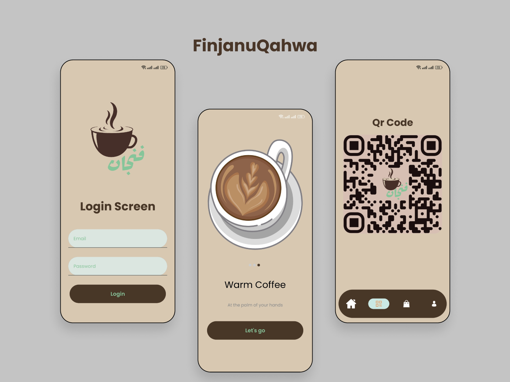

<h2 align="center">Finjan – Coffee Shop App</h2>
<h3 align="center">Ahmed Walid</h3>

    Modern Android Coffee Shop app built with Jetpack Compose
     
    <a href="https://github.com/ahmeddwalid/Finjan/blob/main/README.md"><strong>Explore the docs »</strong></a>
     
     
    <a href="https://github.com/ahmeddwalid/Finjan/issues">Report Bug</a>
    ·
    <a href="https://github.com/ahmeddwalid/Finjan/pulls">Request Feature</a>
  

<!-- ABOUT THE PROJECT -->
## About The Project

**Finjan** is a full-featured Android coffee shop application built with Kotlin and Jetpack Compose. It follows a clean MVVM architecture with Hilt dependency injection, a Room-backed local database, Firebase cloud services, Stripe payments, and a comprehensive security layer.

<!-- FEATURES -->
## Features

### Authentication

- Email/Password sign-in and sign-up
- Google Sign-In via Credential Manager API
- Password reset via email
- Password change with re-authentication
- Biometric authentication support
- Rate-limited login attempts

### Home & Products

- Product browsing with image cards
- Category filtering and featured items
- Real-time menu updates from Firestore
- Dynamic QR code generation for loyalty points

### Cart & Checkout

- Local Room-based cart with quantity management
- Promo code and loyalty points validation
- Full checkout flow with order placement
- Stripe payment integration

### Orders

- Order placement and real-time status tracking via Firestore
- Order history screen
- Order tracking screen with live updates

### Favorites

- Add/remove products from a local favorites list
- Favorites count badge

### Search

- Search with persistent local history (Room)
- Clear individual or all recent searches

### Offers & Promotions

- Dynamic offers fetched from Firestore
- Promo code validation at checkout

### Profile & Settings

- User profile with photo support (Coil)
- Edit profile and change password
- Dark / Light theme toggle (DataStore-persisted)
- Notification preferences
- Legal documents (Terms & Privacy Policy)
- Language / locale support

### Payments

- Stripe payment method management (add / delete)
- Saved payment methods stored in Firestore

### Push Notifications

- Firebase Cloud Messaging (FCM) integration
- FCM token management and updates
- Order status and promotional notifications via `NotificationHelper`

### Security

- Input validation and sanitization (`InputValidator`)
- SQL injection pattern detection
- Rate limiting (`RateLimiter`)
- Encrypted shared preferences (`SecurePreferencesManager`)
- Session management (`SessionManager`)

### System & Infrastructure

- Hilt dependency injection across all layers
- Repository pattern with interface abstractions (`IFirestoreRepository`, `ILocalRepository`, `ILegalRepository`)
- WorkManager background tasks
- Deep link support (`DeepLinkManager`)
- Network connectivity monitoring
- Firebase Analytics, Remote Config, and Crashlytics
- Android Baseline Profiles for startup performance

## Tech Stack

| Layer | Technology |
|---|---|
| Language | Kotlin 2.0 |
| UI | Jetpack Compose, Material 3 |
| Architecture | MVVM + Repository pattern |
| DI | Hilt |
| Navigation | Compose Navigation (type-safe routes) |
| Local Storage | Room, DataStore, Security Crypto |
| Remote Storage | Firebase Firestore |
| Authentication | Firebase Auth, Google Identity, Biometric |
| Payments | Stripe Android SDK |
| Push Notifications | Firebase Cloud Messaging |
| Analytics / Monitoring | Firebase Analytics, Remote Config, Crashlytics |
| Image Loading | Coil |
| Animations | Lottie Compose |
| Background Work | WorkManager |
| Testing | JUnit 4, MockK, Turbine, Coroutines Test |
| Static Analysis | Detekt |
| Performance | Baseline Profiles |

<!-- DOWNLOAD -->
# Download APK (old version)

APK Hashes:

SHA-1: `e3e38991a470b6ca06e94a0b6b13091d6e8c6531`

SHA-256: `144d9c50416eae8a792e385639d82aedc9ed14494e3397cdc7d5fa17cc819785`

SHA-512: `8b097e8f6984f1993339a205b34d4009f6a11620ac3ff9c790974eea5f307ee63c1f826d735aeffed50d1c21beb350ce8d380d70b549d891660d81fc12c76ba3`

<!-- CONTRIBUTING -->
# Contributing

Project's Link: [https://github.com/ahmeddwalid/Finjan](https://github.com/ahmeddwalid/Finjan)

Any contributions you make are **greatly appreciated**.

## How to Contribute

If you'd like to contribute, please follow these steps:

1. **Fork the repository:** Create your own copy of the project.
2. **Create a branch:** `git checkout -b feature/your-feature-name`
3. **Implement your contribution**
4. **Commit your changes:** `git commit -m "your descriptive commit message"`
5. **Push to the branch:** `git push origin feature/your-feature-name`
6. **Create a pull request:** Submit your changes for review.

### Contribution Guidelines

- Please ensure your code follows MVVM design pattern.
- Write clear and concise commit messages.
- Provide detailed explanations in your pull requests.
- Be respectful and considerate of other contributors.

Thank you for your contributions!

# Acknowledgments

- [Android Developers](https://developer.android.com/)
- [Philipp Lackner](https://www.youtube.com/@PhilippLackner)
- [Dynamic Bank Card UI](https://medium.com/deuk/intermediate-android-compose-bank-card-ui-371d14ea7843)
- [Lottie Compose](https://github.com/airbnb/lottie/blob/master/android-compose.md)
- [Coil Image Loading](https://github.com/coil-kt/coil)

<!-- LICENSE -->
# License

This project is distributed under the [Apache 2.0 license](https://choosealicense.com/licenses/apache-2.0/). See
[`LICENSE.txt`](/LICENSE) for more information.

(<a href="#top">back to top</a>)

